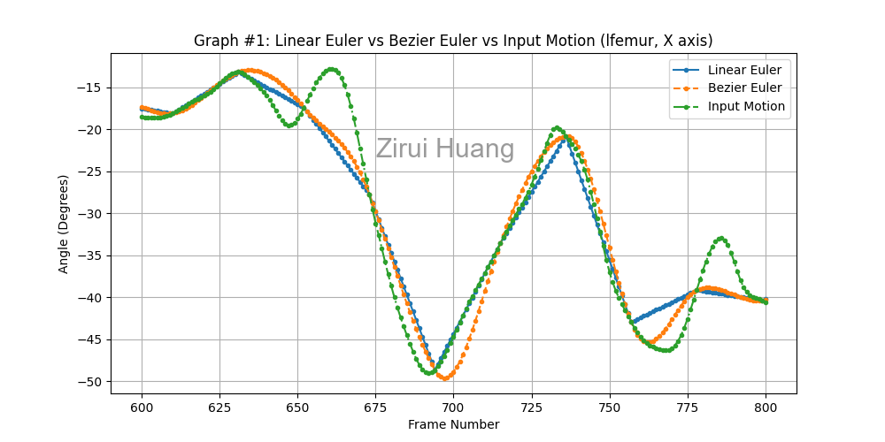
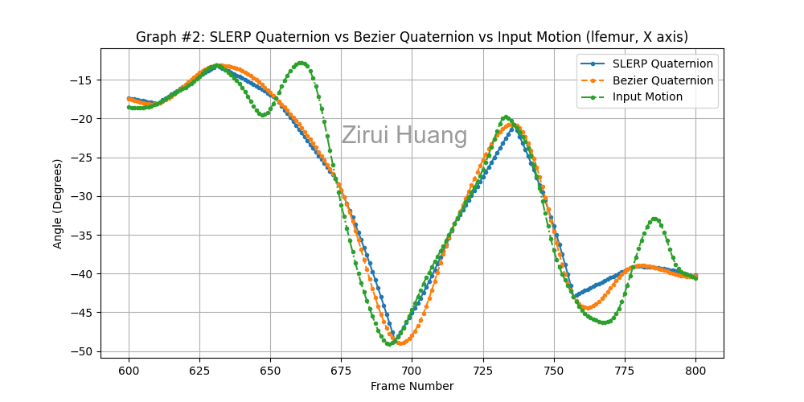
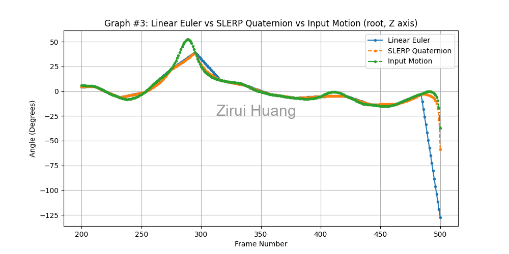
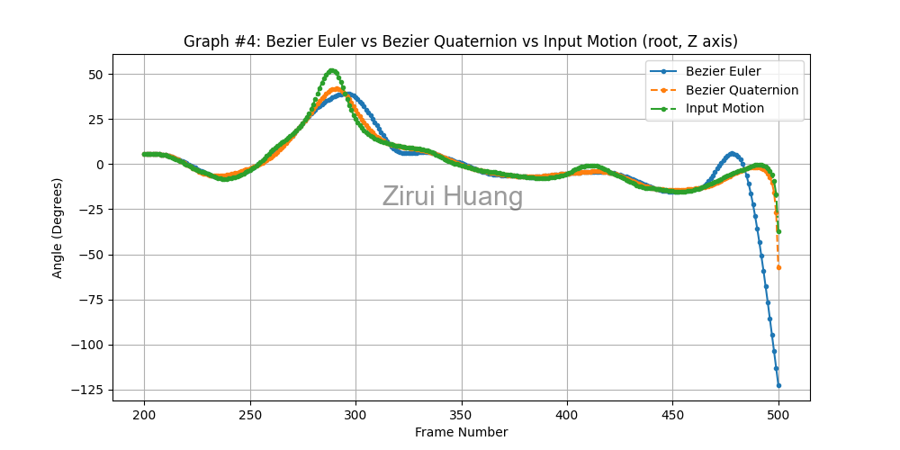

# ComputerAnimationAndSimulation
 C++ implementation of computer animation techniques using OpenGL.
## Motion Capture Interpolation
In this assignment, I implemented **three motion interpolation schemes** to reconstruct human motion sequences based on sparse mocap input.
### Background
- The skeleton is structured as a **hierarchical model** (root + joint children).
- Motion data is from an **optical mocap system**, stored in:
  - `.ASF` files: Skeleton structure (bone lengths, degrees of freedom)
  - `.AMC` files: Motion over time (root translation and joint Euler rotations)

### Task
- For each motion sequence, a subsequence is formed by dropping certain frames 
- Use three different interpolation techniques to reconstruct the full motion:
  1. **Bezier Euler Interpolation**
  2. **Bezier Slerp Quaternion Interpolation**
  3. **Spherical Linear Interpolation (SLERP)**
     
### Interpolation Comparison
Comparison between different interpolations with original input motion
| Method | Graph Result |
|--------|----------------|
| **Linear Euler** vs **Bezier Euler** |  |
| **Slerp Quaternion** vs **Bezier Slerp Quaternion** |  |
| **Linear Euler** vs **Slerp Quaternion** |  |
| **Bezier Euler** vs **Bezier Slerp Quaternion** |  |

### Demo Videos
Number of frames between key frames is 40 (N = 40)
- **Bezier Euler vs Input Motion**: [Bezier Euler](https://drive.google.com/file/d/1LJQ2rgnQviKVxduXUzzT7tMjIXfMHm8R/view?usp=drive_link)
- **Slerp Quaternion vs Input Motion**: [Slerp Quaternion](https://drive.google.com/file/d/1JPWi4fRWHLdD7t1rPyEyPlBP1j62QSW4/view?usp=drive_link)
- **Bezier Slerp Quaternion vs Input Motion**: [Bezier Slerp Quaternion](https://drive.google.com/file/d/1Dg8QXQ5wtZmMXbu8ehXFWJQL2sfy2x48/view?usp=drive_link)
